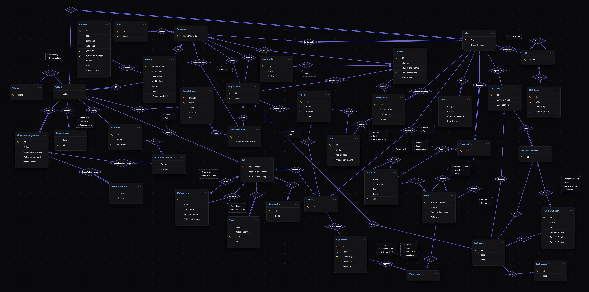

📊 ERD Studio

A modern web-based tool for designing Entity-Relationship Diagrams (ERDs). It provides an interactive workspace for creating entities, defining relationships, and organizing database schemas in a clean and responsive interface.

---

✨ Features

- 🗂️ Interactive Canvas
  
  - Create, move, edit, and organize entities.
  - Responsive workspace with pan and zoom support.

- 🏗️ Entity Editor
  
  - Add, remove, and reorder attributes.
  - Configure Primary Key, Unique, and Nullable properties.

- 🔗 Relationship Designer
  
  - Create relationships between entities.
  - Configure cardinality (1:1, 1:N, M:N).
  - Configure participation (Total / Partial).
  - Move relationship diamonds and attribute boxes freely.

- 💾 Auto Save
  
  - Projects are automatically stored in your browser using Local Storage.

---

🛠️ Tech Stack

<p align="left">
  
</p>- React 18
- Vite
- TypeScript
- Tailwind CSS
- Lucide React
- HTML Canvas API
- html-to-image

---

🚀 Getting Started

Prerequisites

Install [Node.js](https://nodejs.org/en/download) (LTS), which includes npm.

Verify the installation:

```
node -v
npm -v
```

---

Installation

Clone or extract the project, then run:

`npm install`

Start the development server:

`npm run dev`

Open the local address shown in your terminal (typically "http://localhost:3000").

---

📖 Usage

Create Entities

- Create a new entity from the left panel.
- Add attributes to the entity.
- Set Primary Key, Unique, and Nullable options.
- Reorder attributes as needed.

Create Relationships

- Select a source and target entity.
- Choose the relationship name.
- Configure cardinality and participation.
- Adjust the position of relationship labels and attribute boxes on the canvas.

---



---

🐞 Known Bugs

| Issue | Status |
|-------|--------|
| Automatic export does not correctly export the entire diagram. | ❌ Known Issue |
| Manual selection export produces lower image quality than expected. | ❌ Known Issue |
| It does not support composite and derived attributes. | ❌ Known Issue |

---

📄 License

This project is intended for educational and personal use. Feel free to modify and extend it to fit your own database modeling workflow.